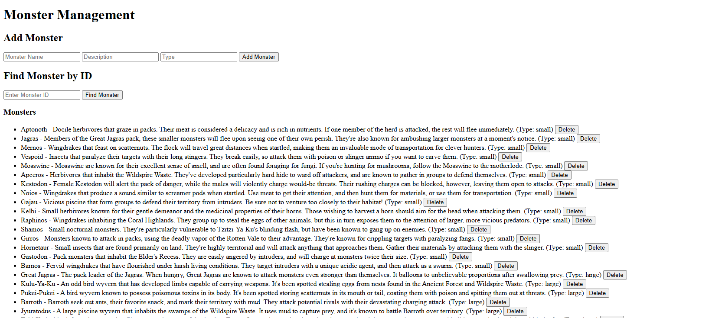
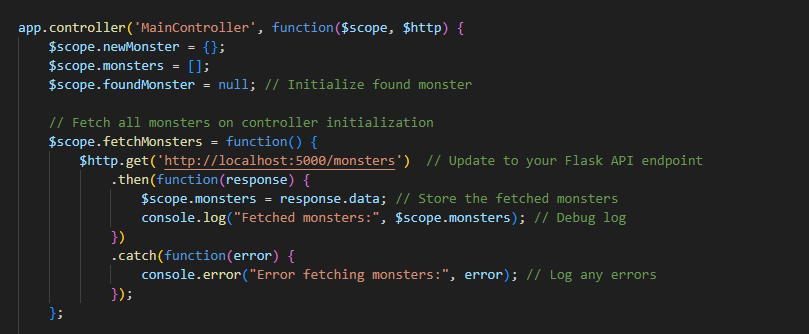

# Assignment4

Start up OAuth2.0 with: cd into OAuth2.0 folder then run node auth.js\
Start up api with: python api.py\
Start up application with: python -m http.server 8000

head to http://localhost:3000/ to start authentication

# UI
\
The image above is the simple UI developed for the backend. It allows for 3 interactive functions for the user. In order starting from the top of the image we have the ability to add a monster to the database, the ability to look up a specific monster given the ID number, and lastly the ability to delete any monster from either the find by ID number or from the monster list shown below.

# Controller
\
The controller will create the scopes/bindings for the user interface to the api. It does this by linking the input data from the index.html file to the http (get, post, delete, put) requests. The api will take each http request and route it to there respected functions based on the request command given. The example above is the get request for a list of all monsters. By saying get with the basic api url it will run the get function in the api with the ID number as 0 which is set to return a jasonify file of all monsters in the database.

# Index HTML
\
The index.html file is where the UI is created. The image above shows an example of a UI element that is linked to the angular app.js file. The Find Monster by Id input field will create a variable called monsterIdToFind that can be used in the button to call the function on click findMonsterById(monsterIdToFind) which will then tell the controller to use the function called findMonsterById with paramater monsterIdToFind. Which is then sent as a get request to the api script in the background which in turn will retun a jasonify file of the monster with given Id if it exists which the Index.html file will use the scope/binding variable foundMonster to display the information to the user.
